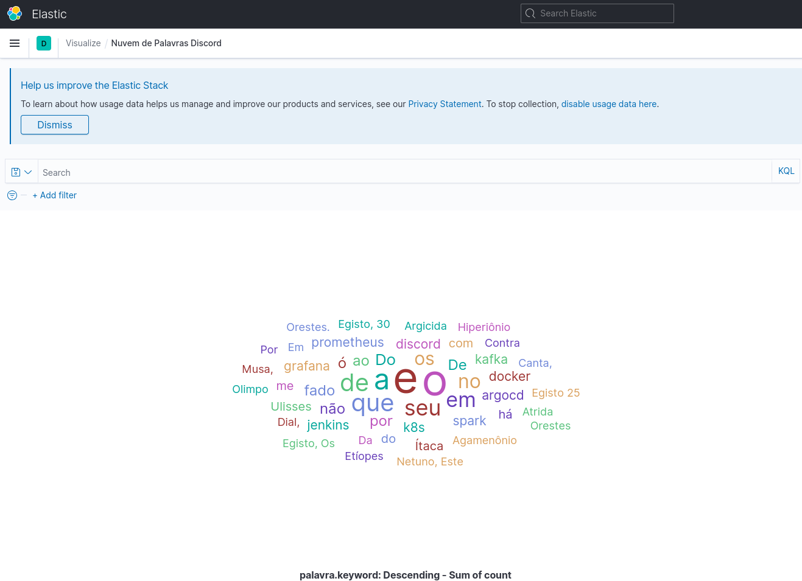
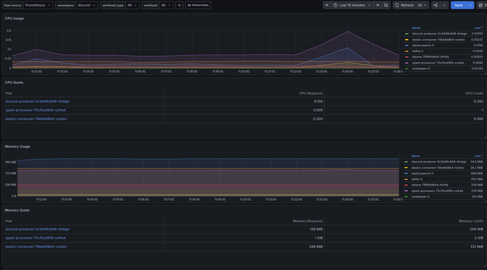
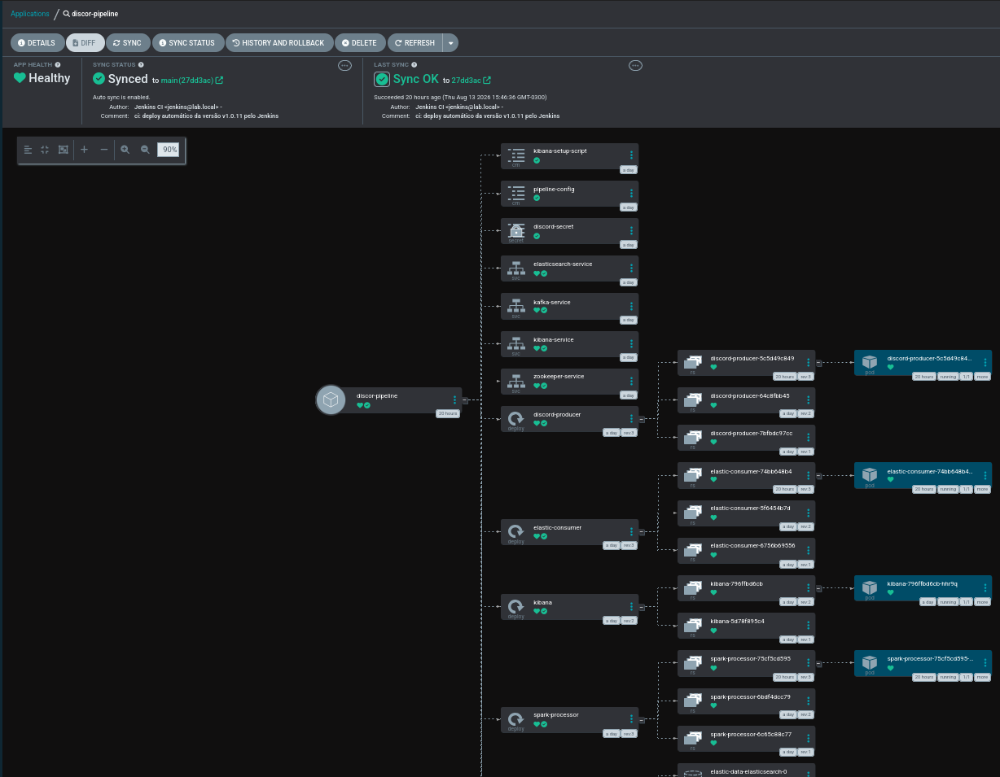

# Real-Time Discord Analytics Pipeline

Uma plataforma de processamento de Big Data em tempo real (Streaming),
provisionada em Kubernetes, focada em ingestão, processamento distribuído e
observabilidade.

Este projeto visa construir um pipeline resiliente de processamento de mensagens
em tempo real. O objetivo é capturar eventos de um servidor do Discord,
processar o fluxo de texto (contagem de palavras) utilizando Apache Spark,
armazenar os resultados no Elasticsearch e exibir análises em Dashboards. Além
de contar com a automação total através de GitOps e monitoramento SRE.

## Arquitetura e Tecnologias
A arquitetura é baseada em microsserviços desacoplados e resilientes:

* **Ingestion:** Python Producer (Discord Bot API).
* **Broker:** Apache Kafka & Zookeeper (Confluent).
* **Processing:** Apache Spark Streaming.
* **Storage & Sink:** Elasticsearch & Python Consumer.
* **Observabilidade:** Prometheus, Grafana e Kibana.
* **Automação (GitOps):** Jenkins (CI) e ArgoCD (CD).

### Topologia
1. **Producer** (Discord) -> **Kafka** (Bus).
2. **Spark** (Processor) consome do Kafka e processa batches.
3. **Elasticsearch** recebe os dados processados para consulta.
4. **Kibana/Grafana** provê visualização de BI e saúde de infraestrutura.

## Demonstrações

* **Word Cloud (Kibana):** Visualização em tempo real das mensagens processadas.
  
* **Observabilidade (Grafana):** Monitoramento de CPU/Memória via PromQL.
  
* **GitOps (ArgoCD):** Deploy automatizado via sincronização Git.
  

## Estrutura do Projeto
```text
/
 ├── /consumer          # Lógica de persistência Elastic -> Kafka
 ├── /producer          # Bot Discord (Producer de eventos)
 ├── /processing        # Jobs de processamento Spark Streaming
 ├── /k8s               # Manifestos: apps-deployment, infra, configmaps, secrets
 ├── /notebooks         # Análise exploratória de dados (EDA)
 ├── /jenkins-lab       # Configurações do servidor CI/CD
 ├── docker-compose.yml # Ambiente de desenvolvimento local
 ├── Dockerfile.app     # Imagem base do Python
 ├── Dockerfile.spark   # Imagem base do Spark
 ├── logger-setup.py    # Utilitário global de logs
 ├── Requirements.txt   # Dependências do projeto
 ├── Jenkinsfile        # Pipeline de CI (Build, Test, Push, GitOps Commit)
 └── README.md
```

## Como executar

### Inicialização do Ambiente
Para provisionar o cluster localmente:

1. **Suba o Cluster Minikube:**
```code
    minikube start --cpus 4 --memory 8192
    minikube addons enable metrics-server
```
2. **Crie os Namespaces Lógicos:**
```code
    kubectl create namespace discord
    kubectl create namespace monitoring
    kubectl create namespace argocd
```
3. **Injete a Stack de Observabilidade (Helm):**
```code
    helm repo add prometheus-community [https://prometheus-community.github.io/helm-charts](https://prometheus-community.github.io/helm-charts)
    helm repo update
    helm install observability prometheus-community/kube-prometheus-stack -n monitoring --set kubelet.serviceMonitor.insecureSkipVerify=true
```
4. **Injete o Operador GitOps (ArgoCD):**
```code
    kubectl apply -n argocd -f [https://raw.githubusercontent.com/argoproj/argo-cd/stable/manifests/install.yaml](https://raw.githubusercontent.com/argoproj/argo-cd/stable/manifests/install.yaml)
```

Após a instalação do ArgoCD, cadastre este repositório na interface gráfica do
operador apontando para o namespace `discord`. O ArgoCD executará o deploy do
Kafka, Zookeeper, Elasticsearch e das aplicações definidas na pasta `/k8s`
automaticamente.


### Destruição (Clean-Up)
Para desligar o laboratório e limpar o disco rígido:

Apaga os Namespaces e todos os componentes de software:

    kubectl delete namespace discord monitoring argocd

Destrói o cluster virtual e libera os recursos alocados:

    minikube stop
    minikube delete

